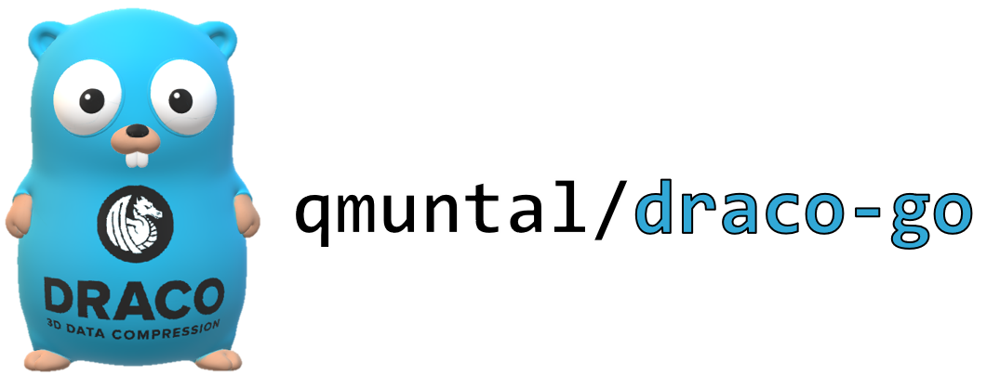

# DRACO GO API

[](https://github.com/qmuntal/draco-go/actions/workflows/test.yml)
[](https://pkg.go.dev/github.com/qmuntal/draco-go/draco)

The Go-Draco package provides Go language bindings for [google/draco](https://github.com/google/draco). Draco is a library for compressing and decompressing 3D geometric meshes and point clouds.

The Go-Draco package supports the latest releases of Draco (v1.4.1) on Linux, macOS, and Windows.

<p align="center"></p>

## Features

- Mesh decoding
- Mesh inspection
- Pre-compiled static libraries for windows and linux

## Usage

This library can be used without any special setup other than having a CGO toolchain in place.

### Decoding

```go
import (
  "io/ioutil"
  "github.com/qmuntal/draco-go/draco"
)

func main() {
  data, _ := ioutil.ReadFile("./testdata/test_nm.obj.edgebreaker.cl4.2.2.drc")
  m := draco.NewMesh()
  d := draco.NewDecoder()
  d.DecodeMesh(data, m)
  fmt.Println("nº faces:", m.NumFaces())
  fmt.Println("nº points:", m.NumPoints())
  faces := m.Faces(nil)
  for i, f := range faces {
    fmt.Printf("%d: %v\n", i, f)
  }
}
```

## Development

The CGO bindings uses a C API that is maintained in [qmuntal/draco-c](https://github.com/qmuntal/draco-c), as the Draco team do not have enough bandwidth to support it. See [google/draco#467](https://github.com/google/draco/pull/663#issuecomment-772802508) for more context.

The libraries in `lib` have been built using: `cmake .. -DDRACO_POINT_CLOUD_COMPRESSION=ON -DDRACO_MESH_COMPRESSION=ON -DDRACO_STANDARD_EDGEBREAKER=ON -DCMAKE_BUILD_TYPE=Release`

## Custom Environment

By default `draco-go` is statically linked against the libraries provided in `/lib`. This behavior can be disabled by supplying -tags customenv when building/running your application. When building with this tag you will need to supply the CGO environment variables yourself.

For example:

```bash
export CGO_LDFLAGS="-L/usr/local/lib -ldraco_c"
```

Please note that you will need to run this line of code one time in your current session in order to build or run the code, in order to setup the needed ENV variables. Once you have done so, you can execute code that uses `draco-go` with your custom environment like this:

```bash
go run -tags customenv ./examples/decode
```

## Third party notice

Builds upon and includes builds of [Google](https://about.google)'s [Draco 3D data compression library](https://google.github.io/draco) (released under the terms of Apache License 2.0).
